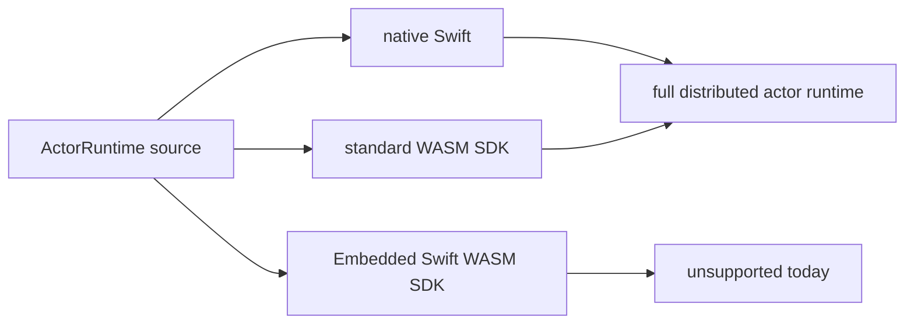

# Swift Actor Runtime

[](https://github.com/1amageek/swift-actor-runtime/actions/workflows/test.yml)
[](https://swift.org)
[](https://opensource.org/licenses/MIT)

Transport-agnostic primitives for implementing Swift Distributed Actor systems.

## Overview

`swift-actor-runtime` provides the foundational building blocks needed by any distributed actor system implementation, regardless of transport layer (BLE, gRPC, HTTP/2, WebSocket, etc.).

**Vision**: "Write once, run on any transport"

### Who Is This For?

| Audience | Use Case |
|----------|----------|
| **Transport Authors** | Building a new distributed actor transport (e.g., MQTT, WebSocket, custom protocol). This library provides all the common infrastructure so you can focus on connectivity. |
| **App Developers** | Using an existing transport (Bleu, ActorEdge). You don't need to use this library directly—it's a dependency of your transport. |

### When to Use This Library

**Use this library if you are:**
- Implementing a new `DistributedActorSystem` for a specific protocol
- Building infrastructure that needs to serialize/deserialize distributed actor calls
- Creating a transport-agnostic layer for your distributed system

**You probably don't need this library directly if you are:**
- Building apps using existing transports like Bleu or ActorEdge
- Just defining distributed actors for your application

## Features

- ✅ **Unified Envelope**: Single `Envelope` type for bidirectional communication
- ✅ **Rich Metadata**: Timestamps, versioning, and custom headers for tracing
- ✅ **Actor Registry**: Thread-safe actor instance tracking via `Mutex`
- ✅ **Codable Codec**: Complete `InvocationEncoder`/`Decoder` implementation
- ✅ **Generic Support**: Full support for generic methods and generic actors
- ✅ **Swift Runtime Integration**: Uses `executeDistributedTarget` for method dispatch
- ✅ **Standard Errors**: Serializable `RuntimeError` types
- ✅ **Symmetric Transport Protocol**: Bidirectional communication where both peers can send invocations
- ✅ **Error Propagation**: `AsyncThrowingStream` for transport-level error handling
- ✅ **No Package Dependencies**: Uses Swift standard library plus Swift toolchain modules (`Distributed`, `Synchronization`, and `FoundationEssentials` when available)
- ✅ **Sendable-Safe**: Full Swift 6 concurrency support

## Platform Support

Swift Actor Runtime treats WebAssembly and Embedded Swift as compiler/runtime
profiles, not as separate source families. The source keeps capability checks at
module boundaries instead of introducing `Wasm` or `Embedded` API variants.



| Compiler profile | Status | Verified command | Notes |
|---|---|---|---|
| Native Swift | Supported | `xcrun swift build` | Full envelope, codec, registry, and transport APIs. Uses `Foundation` fallback when the host SDK does not expose `FoundationEssentials` as an importable module. |
| Standard WASM | Supported | `swift build --swift-sdk swift-6.3.1-RELEASE_wasm` | Full envelope, codec, registry, and transport APIs. `FoundationEssentials`, `Distributed`, and `Synchronization` are available in this profile. |
| Embedded Swift WASM | Not supported | `swift build --swift-sdk swift-6.3.1-RELEASE_wasm-embedded` | The current Embedded Swift SDK makes `Codable` unavailable and does not provide importable `FoundationEssentials`, `Foundation`, or `Distributed`. Supporting this profile would require a new standard-library-only wire format and a non-`DistributedActor` runtime contract. |

`FoundationEssentials` is the preferred import path for browser/runtime builds.
Source files use a capability import so Apple host SDKs that do not expose
`FoundationEssentials` directly continue to build through `Foundation`.

## Installation

### Swift Package Manager

```swift
dependencies: [
    .package(url: "https://github.com/1amageek/swift-actor-runtime", from: "0.6.1")
]
```

## Quick Start

### Using a Transport (e.g., Bleu for BLE)

```swift
import ActorRuntime
import Bleu  // or any other transport

// Define your distributed actor
distributed actor TemperatureSensor {
    typealias ActorSystem = BLEActorSystem

    distributed func readTemperature() async -> Double {
        return 22.5
    }
}

// Server (Peripheral)
let system = BLEActorSystem.mock()
let sensor = TemperatureSensor(actorSystem: system)
try await system.startAdvertising(sensor)

// Client (Central)
let system = BLEActorSystem.mock()
let sensors = try await system.discover(TemperatureSensor.self)
let temp = try await sensors[0].readTemperature()
```

### Implementing a Transport

```swift
import ActorRuntime

public final class MyTransport: DistributedTransport, Sendable {
    public var messages: AsyncThrowingStream<Envelope, Error> {
        AsyncThrowingStream { continuation in
            // Listen for incoming messages on your transport
            // Yield both invocations and responses
            // Use continuation.finish(throwing:) for transport errors
        }
    }

    public func start() async throws {
        // Initialize connection (bind port, connect to peer, etc.)
    }

    public func send(_ envelope: Envelope) async throws {
        // Serialize and send envelope over your protocol
        switch envelope {
        case .invocation(let inv):
            // Send invocation request
        case .response(let res):
            // Send response
        }
    }

    public func stop() async {
        // Close connections and cleanup resources
    }
}
```

The transport protocol supports **symmetric bidirectional communication** - both peers can send invocations and responses, enabling P2P patterns and server-initiated calls.

## Architecture

```
┌──────────────────────────────────┐
│    Your Distributed Actors       │
└────────────┬─────────────────────┘
             │
┌────────────┴─────────────────────┐
│    Transport Implementation      │
│   (Bleu, ActorEdge, Custom)      │
└────────────┬─────────────────────┘
             │
┌────────────┴─────────────────────┐
│    swift-actor-runtime           │
│  ┌────────────────────────────┐  │
│  │ Envelope                   │  │
│  │   ├─ InvocationEnvelope    │  │
│  │   └─ ResponseEnvelope      │  │
│  │ ActorRegistry              │  │
│  │ CodableInvocationEncoder   │  │
│  │ CodableInvocationDecoder   │  │
│  │ RuntimeError               │  │
│  │ DistributedTransport       │  │
│  └────────────────────────────┘  │
└──────────────────────────────────┘
```

## Core Components

### Envelope

Unified message type for bidirectional communication:

```swift
// Wrap invocations and responses in a single type
let message: Envelope = .invocation(invocationEnvelope)
let reply: Envelope = .response(responseEnvelope)

// Pattern match to handle messages
for try await envelope in transport.messages {
    switch envelope {
    case .invocation(let inv):
        // Handle incoming method call
    case .response(let res):
        // Handle response to a previous call
    }
}
```

### InvocationEnvelope

Represents a distributed method call with metadata:

```swift
let envelope = InvocationEnvelope(
    recipientID: "sensor-1",
    senderID: "client-1",           // Optional sender identifier
    target: "readTemperature",
    genericSubstitutions: [],        // For generic methods
    arguments: [],                   // One Data blob per parameter
    metadata: .init(
        headers: ["trace-id": "abc123"]  // Custom headers for tracing
    )
)
```

### ResponseEnvelope

Represents the result with metadata:

```swift
let response = ResponseEnvelope(
    callID: envelope.callID,
    result: .success(resultData),
    metadata: .init(executionTime: 0.05)  // Optional execution timing
)

// Convenient methods for adding metadata
let enriched = response
    .withExecutionTime(0.05)
    .withHeader("trace-id", value: "abc123")
```

### ActorRegistry

Tracks actor instances:

```swift
let registry = ActorRegistry()
registry.register(sensor, id: "sensor-1")

if let actor = registry.find(id: "sensor-1") {
    // Execute method on actor
}

// Important: Cleanup when done to prevent memory leaks
registry.unregister(id: "sensor-1")

// Or clear all actors during shutdown
registry.clear()
```

**Memory Management**: `ActorRegistry` maintains strong references. Always call `unregister(id:)` when actors are no longer needed to prevent memory leaks.

### RuntimeError

Standard error types:

```swift
throw RuntimeError.actorNotFound("sensor-1")
throw RuntimeError.methodNotFound("readTemperature")
throw RuntimeError.timeout(10.0)
```

### Error Handling

The `messages` stream uses `AsyncThrowingStream` to propagate transport-level errors:

```swift
// In your ActorSystem's message loop
do {
    for try await envelope in transport.messages {
        switch envelope {
        case .invocation(let inv):
            await handleInvocation(inv)
        case .response(let res):
            await handleResponse(res)
        }
    }
} catch {
    // Handle transport errors (connection lost, deserialization failed, etc.)
    print("Transport error: \(error)")
}
```

Transport implementations can signal errors using the continuation:

```swift
public var messages: AsyncThrowingStream<Envelope, Error> {
    AsyncThrowingStream { continuation in
        // On successful message
        continuation.yield(.invocation(envelope))

        // On transport error
        continuation.finish(throwing: RuntimeError.transportFailed("Connection lost"))

        // On clean shutdown
        continuation.finish()
    }
}
```

## Platform Support

- Swift 6.3+
- iOS 18.0+
- macOS 15.0+
- watchOS 11.0+
- tvOS 18.0+
- visionOS 2.0+

## Transports Using This Runtime

- [Bleu](https://github.com/1amageek/Bleu) - BLE (Bluetooth Low Energy)
- [ActorEdge](https://github.com/1amageek/actor-edge) - gRPC
- *Your transport here!*

## Codec System

### CodableInvocationEncoder / Decoder

The Codec system enables distributed method calls with Codable arguments:

```swift
// In your DistributedActorSystem implementation
func remoteCall<Act, Err, Res>(
    on actor: Act,
    target: RemoteCallTarget,
    invocation: inout InvocationEncoder,
    throwing: Err.Type,
    returning: Res.Type
) async throws -> Res {
    var encoder = invocation as! CodableInvocationEncoder
    encoder.recordTarget(target)

    let envelope = try encoder.makeInvocationEnvelope(
        recipientID: actor.id.description
    )

    // Send envelope over your transport
    try await transport.send(.invocation(envelope))

    // Await response via messages stream (implementation handles callID matching)
    let response = try await awaitResponse(callID: envelope.callID)

    // Decode result
    switch response.result {
    case .success(let data):
        return try JSONDecoder().decode(Res.self, from: data)
    case .void:
        return () as! Res
    case .failure(let error):
        throw error
    }
}
```

See [Examples/InMemoryTransport.swift](Examples/InMemoryTransport.swift) for a complete working implementation.

## Documentation

- [Design Documentation](Documentation/DESIGN.md) - Detailed architecture and design decisions
- [Codec System Design](Documentation/CODEC.md) - InvocationEncoder/Decoder implementation details
- [InMemoryTransport Example](Examples/InMemoryTransport.swift) - Complete working transport implementation

## License

MIT License

## Author

[@1amageek](https://github.com/1amageek)
